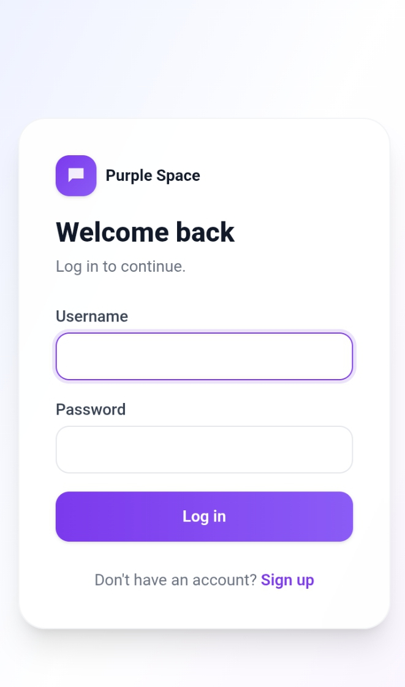
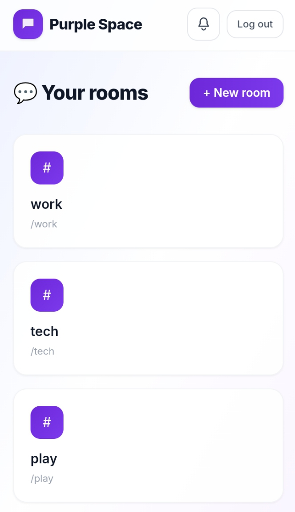
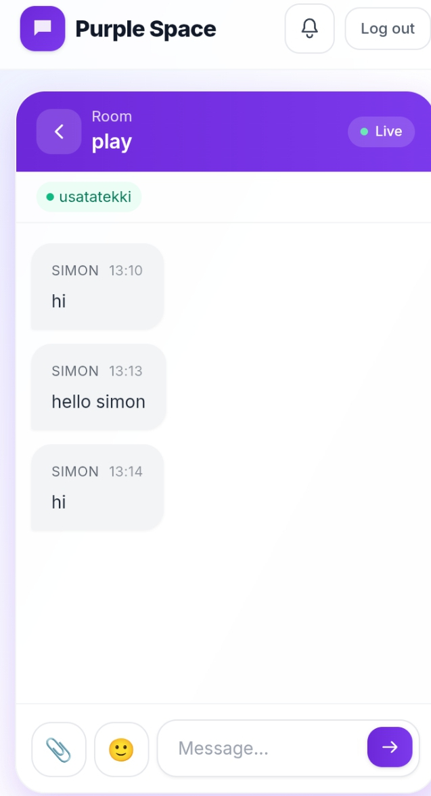

# Purple Space

> A real-time, room-based chat application built with Django and Django Channels — sign up, join or create rooms, and chat live with typing indicators, presence, reactions, replies, and file sharing.

---

## 📸 Demo / Screenshots

<!-- If you deploy it, drop the live link here -->
**Live demo:** [your-app-name.onrender.com](#)

<!-- Add screenshots to a `screenshots/` folder in your repo and reference them like this: -->




---

## ✨ Features

- **Authentication** — sign up, log in, log out, with relaxed but sane password rules (min. 8 characters, not all-numeric)
- **Room-based messaging** — create rooms, invite specific registered users, accept/decline invites
- **Membership-gated access** — you only see and can join rooms you're actually a member of (enforced at both the page level and the WebSocket connection level)
- **Real-time messaging** — instant delivery over WebSockets via Django Channels, no page refresh
- **Live presence** — see who's currently online in a room
- **Typing indicators** — see when someone else is typing
- **Message replies** — quote and reply to a specific message
- **Message editing & deletion** — edit or delete your own messages (soft-deleted, so replies to a deleted message stay intact)
- **Emoji reactions** — react to any message, live-updating for everyone in the room
- **Emoji picker** — quick emoji insert when composing a message
- **File uploads** — share files/images directly in a room (10MB limit), broadcast live to everyone connected
- **Cross-room notifications** — get a live toast if a message arrives in a room you're not currently viewing
- **Persistent notifications** — a notifications page and unread-count bell showing room invites, oldest to newest
- **Fully responsive** — works across desktop and mobile screen sizes

---

## 🛠 Technologies Used

- **Backend:** Python, Django
- **Real-time layer:** Django Channels, Daphne (ASGI server)
- **Database:** SQLite (default, dev-friendly; swap for PostgreSQL for production if needed)
- **Frontend:** Django templates, Tailwind CSS (via CDN), vanilla JavaScript (WebSocket client, no frontend framework)
- **Config:** python-dotenv for environment-based settings
- **Deployment:** Render (using Daphne as the ASGI server)

---

## ⚙️ Installation & Setup

Clone the repository:
```bash
git clone https://github.com/your-username/purple-space.git
cd purple-space/mysite
```

Create and activate a virtual environment:
```bash
python -m venv venv
source venv/bin/activate      # Windows: venv\Scripts\activate
```

Install dependencies:
```bash
pip install -r requirements.txt
```

Set up your `.env` file (see **Environment Variables** below), then run migrations:
```bash
python manage.py migrate
```

Create a superuser (optional, for admin access at `/admin/`):
```bash
python manage.py createsuperuser
```

Run the development server:
```bash
python manage.py runserver
```

Visit `http://127.0.0.1:8000/` — you'll land on the signup page.

---

## 🔑 Environment Variables

This project reads its configuration from a `.env` file (never committed —
see `.gitignore`). Copy `.env.example` to `.env` and fill in your own values:

```bash
cp .env.example .env
```

Keys used:

```
# A long random string — never reuse the example/dev value in production
DJANGO_SECRET_KEY=

# True for local development, False in production
DJANGO_DEBUG=

# Comma-separated list of domains allowed to serve the app
# e.g. 127.0.0.1,localhost,your-app-name.onrender.com
DJANGO_ALLOWED_HOSTS=

# Slug of the room new users land in after signup/login
DEFAULT_ROOM_SLUG=tech

# Optional — only needed if you want to override the auto-derived CSRF
# trusted origins (by default, derived from DJANGO_ALLOWED_HOSTS)
DJANGO_CSRF_TRUSTED_ORIGINS=
```

No third-party API keys are required to run this project — it doesn't use
any external services (payments, cloud storage, etc.) as shipped.

---

## 🚀 Usage

1. **Sign up** — create an account (no invite needed for your first account).
2. **Log in** — you'll be dropped straight into the default room.
3. **Browse or create rooms** — from the homepage, view rooms you belong to, or create a new one and invite other registered users.
4. **Accept invites** — if someone invites you to a room, you'll see a banner on your homepage (and it stays in your Notifications page if you miss it).
5. **Chat** — send messages, reply to a specific one, react with emoji, edit or delete your own messages, and share files — all live.
6. **Go back** — use the back arrow in the room header to return to your room list at any time.

---

## 🚢 Deployment Notes

This project runs on **ASGI**, not WSGI, because of the WebSocket layer. When deploying:

- Start command must run Daphne against the ASGI app, e.g.:
  ```
  daphne -b 0.0.0.0 -p $PORT mysite.asgi:application
  ```
- Set `DJANGO_ALLOWED_HOSTS` to your actual deployed domain — `CSRF_TRUSTED_ORIGINS` is derived from it automatically.
- SQLite works for a demo, but most free-tier hosts don't guarantee persistent disk storage — for anything long-lived, swap in PostgreSQL.

---

## 📄 License

This project is licensed under the MIT License.
